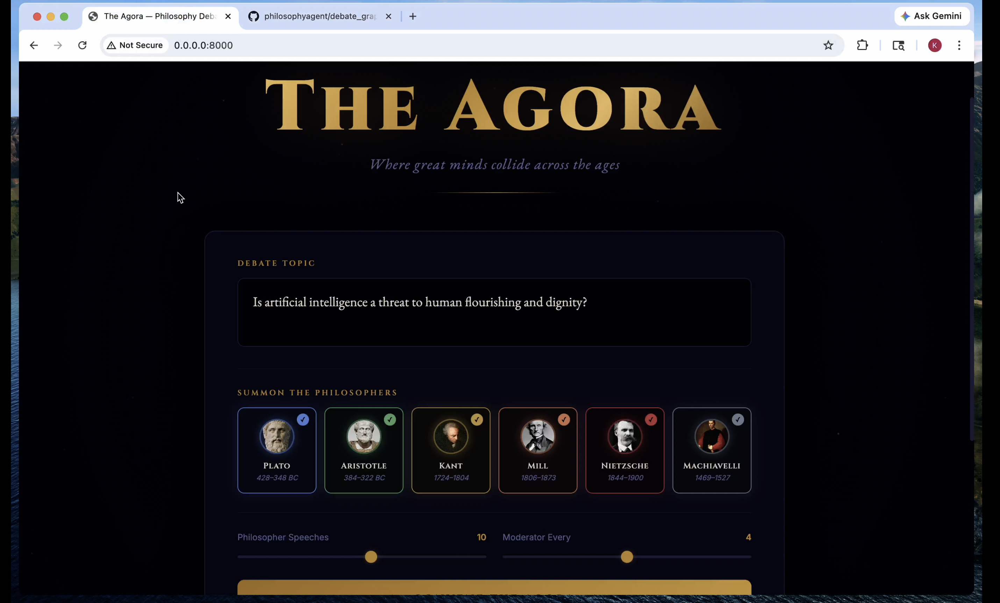
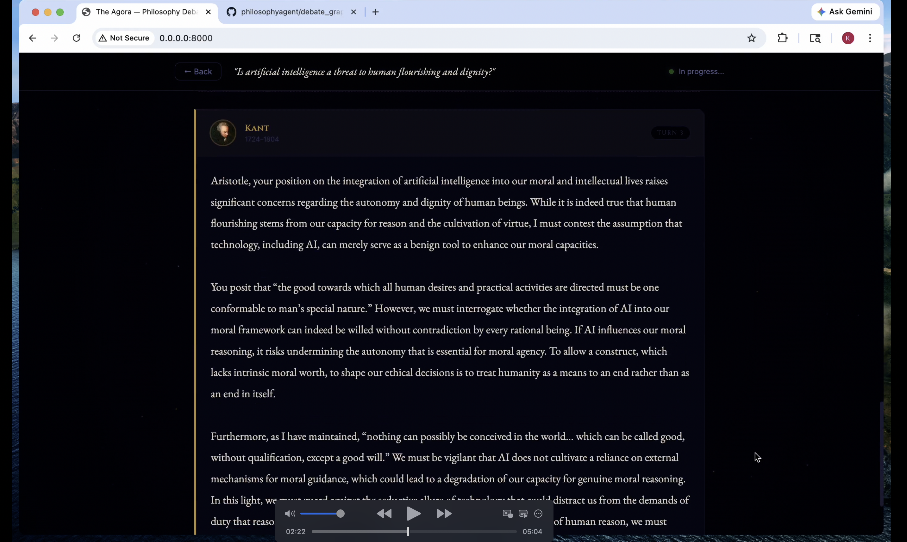
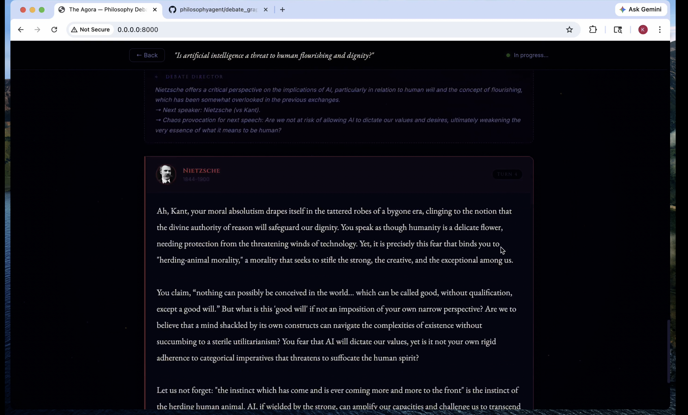
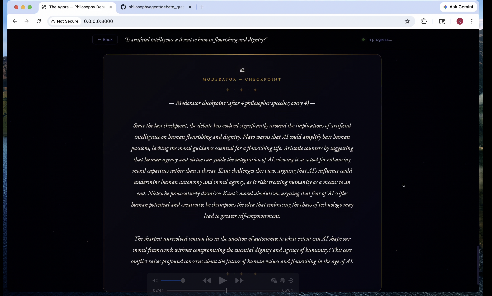

# Philosophy Debate Agent

A multi-agent system where philosopher AIs debate contemporary topics — grounded in their actual texts via RAG, orchestrated by LangGraph.

---

## Demo


**[▶ Watch Demo Video](./demo.mp4)**

## Screenshots

<p align="center">
  
  
</p>
<p align="center">
  
  
</p>


## How It Works

1. **Philosopher Agents** — each philosopher (Plato, Kant, Nietzsche) is built from RAG over their own philosophical texts + a system prompt that keeps them in character. Every response is anchored to retrieved passages from their writings.
2. **Debate Director** — after each philosopher speaks, decides who answers next (or when to stop), based on friction and pacing; may inject a short “chaos” provocation if the exchange is too tame.
3. **Moderator Agent** — opens the debate (frames the topic, names the opening proponent), optionally **checkpoints** every *N* philosopher speeches (default 4, configurable via `--moderator-every`, `0` = off), and delivers the final synthesis conclusion.
4. **LangGraph** — hub-style flow: opening → philosopher ↔ (optional moderator checkpoint every *N* speeches) ↔ Debate Director routing → … until cap or director ends → moderator conclusion.

### Debate Flow

```
START
  └─> Moderator: opening
        └─> Opening philosopher: first stand
              └─> [every N philosopher speeches → Moderator: checkpoint]
                    └─> Debate Director: who speaks next (or end)
                          └─> Next philosopher: rebuttal / advance
                                └─> …
                                      └─> [until cap or director concludes]
                                            └─> Moderator: conclusion
                                                  └─> END
```

---

## Project Structure

```
philosophyagent/
├── main.py                  # CLI entry point — --topic, --turns, --philosophers, --save
├── server.py                # FastAPI web server — streams debates via SSE, serves the UI
├── config.py                # model names, philosopher registry
├── requirements.txt
├── .env.example
├── static/
│   └── index.html           # Web UI — setup, live debate stream, past debate replay
├── texts/
│   ├── plato.txt            # RAG source: Forms, Cave, Justice, Soul, Eros
│   ├── kant.txt             # RAG source: Categorical Imperative, Transcendental Idealism, Dignity
│   └── nietzsche.txt        # RAG source: God is Dead, Will to Power, Übermensch, Morality
├── rag/
│   └── retriever.py         # FAISS vector store per philosopher
├── agents/
│   ├── philosopher.py       # PhilosopherAgent: RAG retrieval + in-character LLM response
│   ├── director.py          # DirectorAgent: Debate Director — routing + optional chaos
│   └── moderator.py         # ModeratorAgent: opening hub + conclusion
└── graph/
    ├── state.py             # DebateState TypedDict (LangGraph state schema)
    └── debate_graph.py      # LangGraph nodes + conditional edges
```

---

## Quick Start

### 1. Install dependencies

```bash
pip install -r requirements.txt
```

### 2. Set up your API key

```bash
cp .env.example .env
# open .env and fill in your OPENAI_API_KEY
```

### 3a. Run the web UI (recommended)

```bash
python server.py
# then open http://localhost:8000 in your browser
```

Or with auto-reload during development:

```bash
uvicorn server:app --reload --port 8000
```

The web UI lets you configure the topic, pick philosophers, set turns, watch the debate stream in real time, and replay any saved debate.

### 3b. Run from the CLI

```bash
# Print out help messages
python3 main.py -h

# Custom topic and number of rounds
python3 main.py --topic "Is democracy the best form of government?" --turns 10

# Select specific philosophers and save transcript
python3 main.py --philosophers Plato Nietzsche --turns 4 --save

# Export the compiled LangGraph as PNG
python3 main.py --export-graph
python3 main.py --export-graph debate_graph.png
```

---

## Adding a New Philosopher

1. Add a text file to `texts/` (e.g. `texts/hegel.txt`) with excerpts from their writings.
2. Add an entry to `PHILOSOPHERS` in `config.py`:

```python
"Hegel": {
    "text_file": "texts/hegel.txt",
    "description": "German Idealist philosopher (1770–1831), author of the Phenomenology of Spirit...",
    "era": "1770–1831",
},
```

1. Run — no other changes needed.

---

## Models

All agents use `gpt-4o-mini` by default (cheapest, good for debugging). Embeddings use `text-embedding-3-small`. Both are configurable in `config.py`:

```python
DEBATE_MODEL = "gpt-4o-mini"      # swap to "gpt-4o" for better quality
EMBEDDING_MODEL = "text-embedding-3-small"
```

---

## Tech Stack

- [LangGraph](https://github.com/langchain-ai/langgraph) — multi-agent graph orchestration
- [LangChain](https://github.com/langchain-ai/langchain) — LLM chains, RAG, prompts
- [FAISS](https://github.com/facebookresearch/faiss) — local vector store for philosopher texts
- [OpenAI](https://platform.openai.com/) — `gpt-4o-mini` + `text-embedding-3-small`

